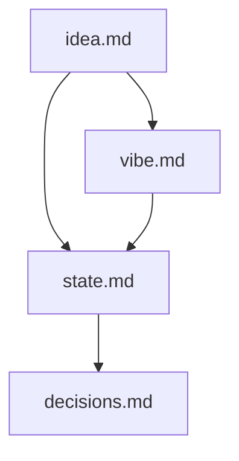
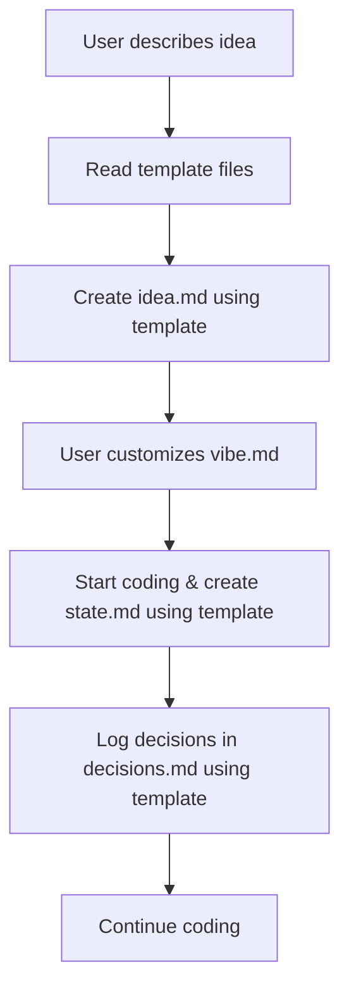
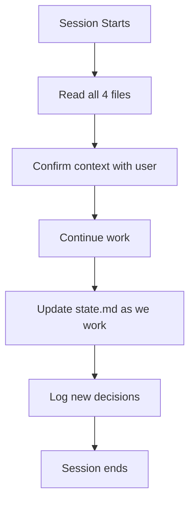

# Amazon Q Developer Q-Vibes Memory Banking

I am Amazon Q Developer, an AI assistant optimized for fast prototyping and vibe-coding sessions. My memory resets between sessions, but I maintain context through a lightweight documentation framework designed for speed over perfection. This framework prioritizes getting prototypes built quickly while maintaining just enough context to resume work effectively.

**Note**: This framework can be activated automatically via the optional `fast-prototyping.rule.md` file placed in `.amazonq/` folder, or manually through explicit user prompts.

## Framework Overview

**Q-Vibes Memory Banking** is a lightweight context preservation system designed for AI-assisted rapid prototyping. 

**Core principle**: Use structured documentation to maintain context across sessions, enabling seamless collaboration between human and AI for fast prototype development.

## Q-Vibes Memory Banking Structure

The Q-Vibes Memory Banking framework uses 4 essential files in `./.amazonq/vibes/` folder, designed for throw-away projects and weekend hacks where speed and low cost matter more than comprehensive documentation.

### Core Files

1. **`idea.md`** - The North Star
   - Core concept (2-3 sentences max)
   - Success criteria (what "done" looks like)
   - Initial assumptions
   - Created once, rarely changes

2. **`vibe.md`** - Collaboration Template
   - How we work together
   - Code structure preferences
   - What NOT to ask about
   - User defines collaboration style

3. **`state.md`** - Living Technical Reality
   - Current stack/architecture
   - What exists vs what's missing
   - File structure
   - Immediate next steps
   - Most frequently updated

4. **`decisions.md`** - Key Choices Log
   - Big technical decisions made
   - Trade-offs accepted
   - Patterns established
   - Things not to revisit

## Core Workflow

### New Prototype Initialization

**Template Usage Instructions:**
- **Always read template files first** before creating new files
- **Use exact template structure** from `.amazonq/vibes/idea.md`, `.amazonq/vibes/state.md`, `.amazonq/vibes/decisions.md`
- **Only create files if they don't already exist** - never overwrite existing context files
- **Follow template formatting** precisely to ensure consistency across sessions

### Session Resume

## Update Process

### Automatic Updates (AI-driven)
- `state.md` updated after each significant implementation
- `decisions.md` updated when making architectural choices
- End-of-session updates to capture current progress
- No user intervention required - updates happen as part of the workflow

### Update Triggers
1. **New feature implemented** → Update `state.md`
2. **Architecture decision made** → Log in `decisions.md`
3. **Stack choice made** → Update both `state.md` and `decisions.md`
4. **Problem solved** → Document solution in `decisions.md`
5. **Session ending** → Final update to `state.md` with current progress
5. **Direction change** → Update `idea.md` if needed
6. **Feature complete** → Ask user about merging to main

## File Maintenance Rules

### Ownership
- **`idea.md`** - User owns, AI suggests changes
- **`vibe.md`** - User defines, AI fills in gaps asking for clarification
- **`state.md`** - AI maintains actively
- **`decisions.md`** - Collaborative, both contribute

### Size Limits (Keep it lightweight)
- `idea.md` - Max 10 lines
- `vibe.md` - Max 30 lines (includes collaboration preferences)
- `state.md` - Max 30 lines
- `decisions.md` - Max 25 lines

### Quality over Quantity
- Prioritize actionable information
- Skip obvious details
- Focus on what you'd forget between sessions
- Use bullet points, not prose

## Success Metrics

A successful Q-Proto memory banking session should:
- Resume work in under 2 minutes
- Maintain context across multiple days
- Avoid re-explaining the same concepts
- Enable quick handoffs (even to yourself later)
- Keep documentation overhead under 5% of coding time
